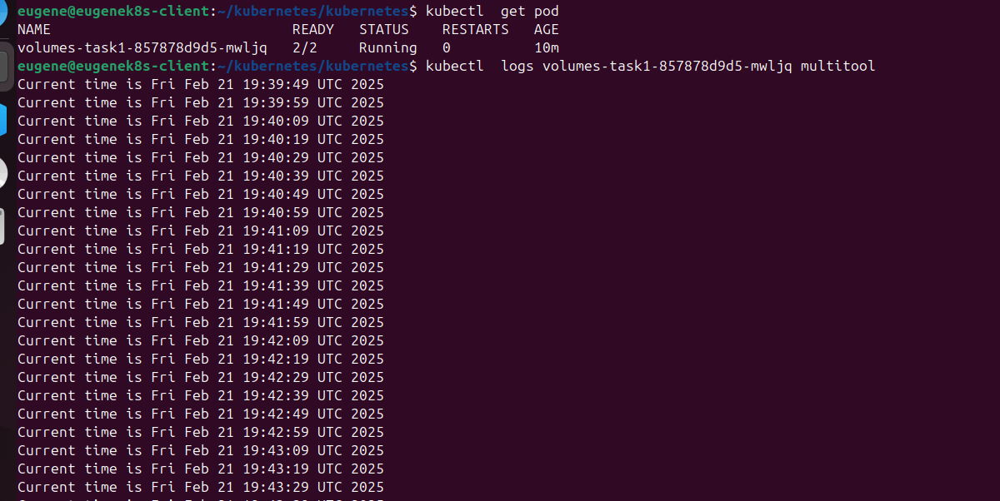
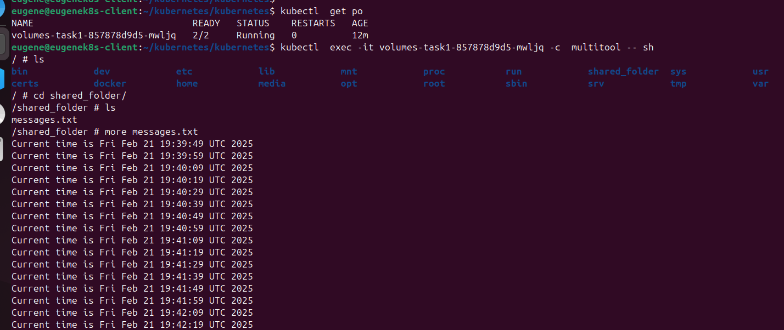
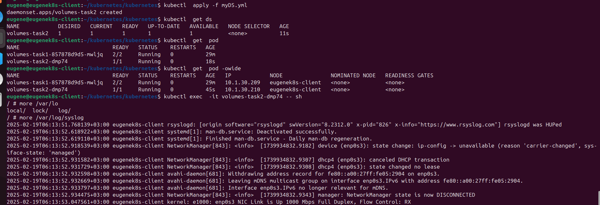

Task 1:

1. Создание POD

2. Volume в контейнере multitool

3. Deployment манифест 

[Deployment.yaml](mydepl1.yml)

Task 2:

1. Создание Daemonset

2. Daemonset манифест

[Daemonset.yaml](myDS.yml)
