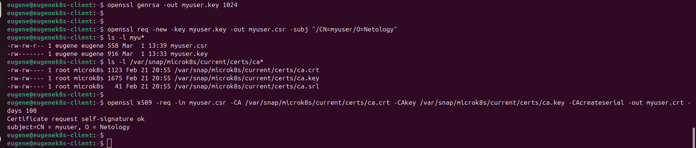

1. С помощью openssl создание ключа myuser.key и Certificate Signing Request - myuser.csr.
Подписание myuser.csr с помощью ca.crt, ca.key.

openssl genrsa -out myuser.key 1024

openssl req -new -key myuser.key -out myuser.csr -subj "/CN=myuser/O=Netology"

openssl x509 -req -in myuser.csr -CA /var/snap/microk8s/current/certs/ca.crt -CAkey /var/snap/microk8s/current/certs/ca.key -CAcreateserial -out myuser.crt -days 100

2.