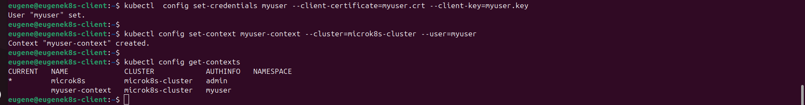
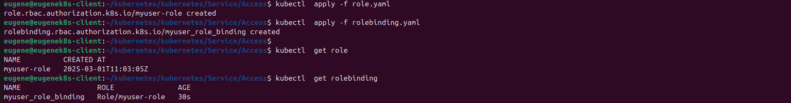
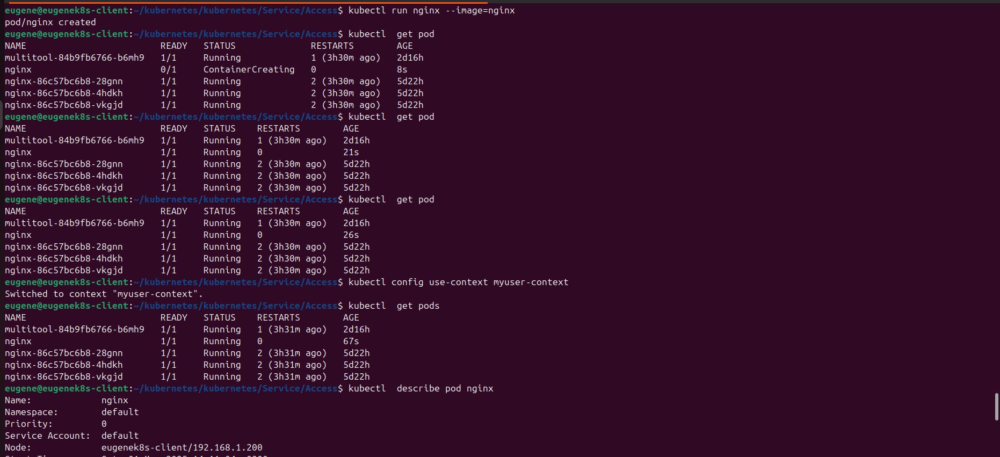
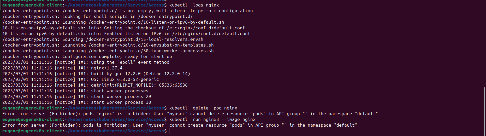

1. С помощью openssl создание ключа myuser.key и Certificate Signing Request - myuser.csr.
Подписание myuser.csr с помощью ca.crt, ca.key.

openssl genrsa -out myuser.key 1024

openssl req -new -key myuser.key -out myuser.csr -subj "/CN=myuser/O=Netology"

openssl x509 -req -in myuser.csr -CA /var/snap/microk8s/current/certs/ca.crt -CAkey /var/snap/microk8s/current/certs/ca.key -CAcreateserial -out myuser.crt -days 100

2. Создание пользователя, контекста.

kubectl  config set-credentials myuser --client-certificate=myuser.crt --client-key=myuser.key

kubectl config set-context myuser-context --cluster=microk8s-cluster --user=myuser

3. Манифесты Role и Rolebindings:

microk8s enable rbac

[Role](role.yaml)

[Rolebindings](rolebinding.yaml)

4. Проверка созданного пользователя, контекста:

kubectl config use-context myuser-context

