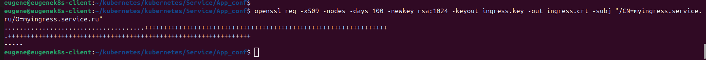
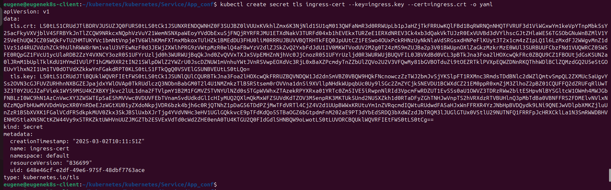
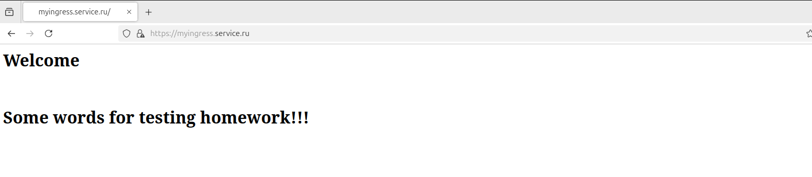

Task 1:

1. Применение манифеста Deployment. Ошибка в контейнере Multitool - Address in use.
Стандартный порт, который используется в multitool занят. Необходимо использовать альтернативный.Решать возникшую проблему буду с помощью ConfigMap.

2025/03/02 07:42:24 [emerg] 1#1: bind() to 0.0.0.0:80 failed (98: Address in use)

2. Применение манифестов  - финальный Deployment, ConfigMap, Service. Состояние контейнера multitool:

Контейнер запустился, так как проблема с портом контейнера была устранена.

3. Проверка nginx pod:

Текст индексной страницы совпадает с тем что в ConfigMap.

4. Манифесты:

[Deployment](Deployment.yaml)

[ConfigMap](ConfigMap.yaml)

[Service](Service.yaml)

Task 2:

1. Манифест Deployment из первого задания, только с одним nginx контейнером.
ConfigMap из первого задания.

[Deployment2](Deployment2.yaml)

[ConfigMap](ConfigMap.yaml)

2. Выпускаю самоподписной сертификат SSL.

openssl req -x509 -nodes -days 100 -newkey rsa:1024 -keyout ingress.key -out ingress.crt -subj "/CN=myingress.service.ru/O=myingress.service.ru"

kubectl create secret tls ingress-cert --key=ingress.key --cert=ingress.crt -o yaml

3. Создал Secret type tls:

5. Проверка работы https:

 

6. Манифесты:

[Deployment2](Deployment2.yaml)

[Ingress](Ingress2.yaml)

