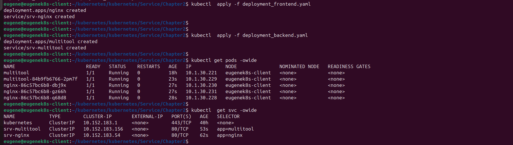
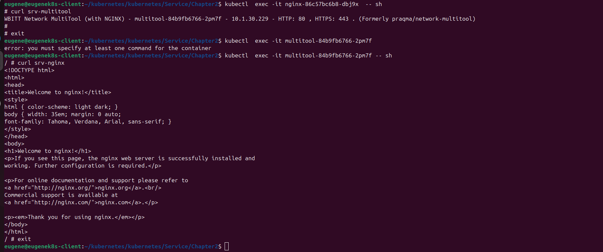
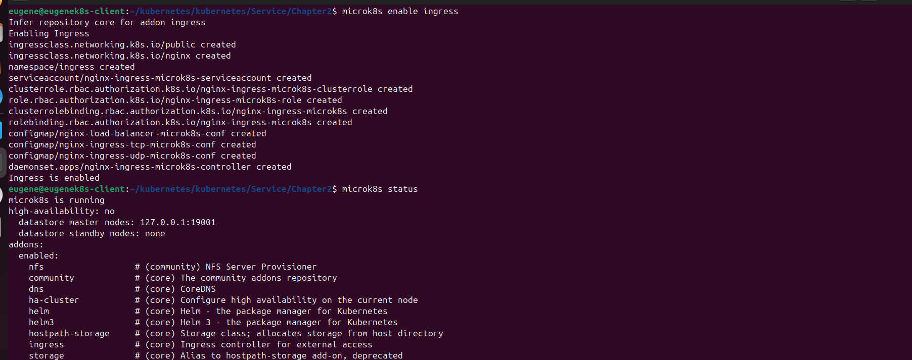
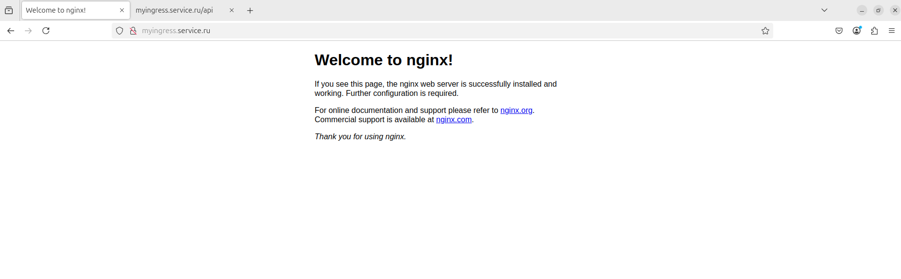
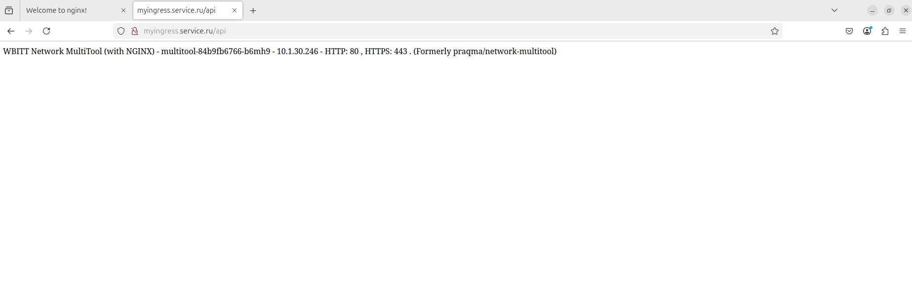

Task 1:

1. Применение манифестов Deployment, SVC frontend and backend. Состояние PODs, SVC.

2. Проверка с помощью curl:

3. Манифесты:

[Frontend](deployment_frontend.yaml)

[Backend](deployment_backend.yaml)

Task 2:

1. Enable Ingress.

kubectl  apply -f Ingress.yaml 

2. Доступ с помощью браузера:

eugene@eugenek8s-client:~/kubernetes/kubernetes/Service/Chapter2$ more /etc/hosts | grep myi
192.168.1.200 myingress.service.ru 

http://myingress.service.ru

http://myingress.service.ru/api

3. Манифест Ingress:

[Ingress](Ingress.yaml)

