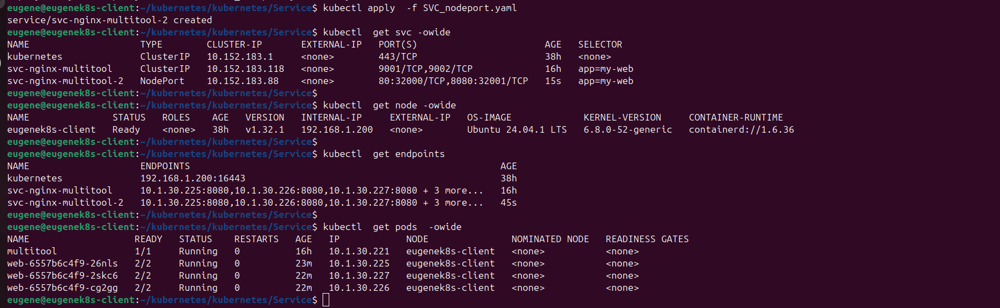

Task 1:

1. Применение манифестов Deployment, SVC, POD. Состояние PODs, SVC.

2. Проверка с помощью curl:

3. Манифесты:

[Deployment](deployment.yml)

[SVC](svc.yaml)

[POD](pod.yml)

Task 2:

1. Применение манифестов SVC Nodeport type. Состояние PODs, SVC.

2. Доступ с помощью браузера на порт 32000

3. Доступ с помощью браузера на порт 32001

