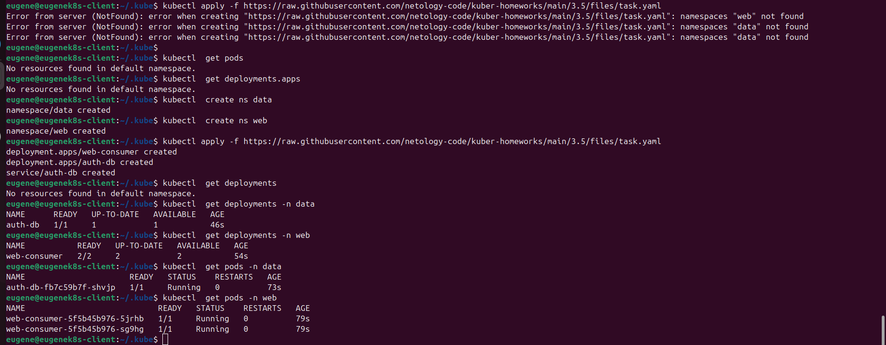
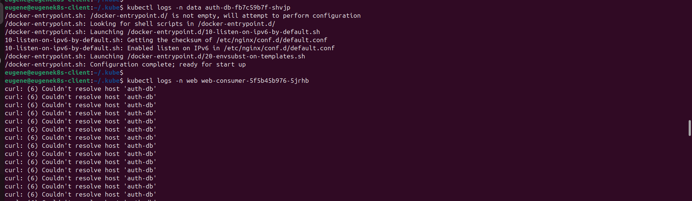
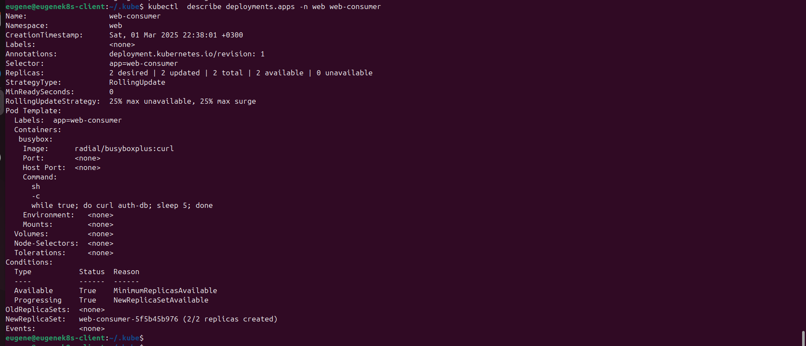
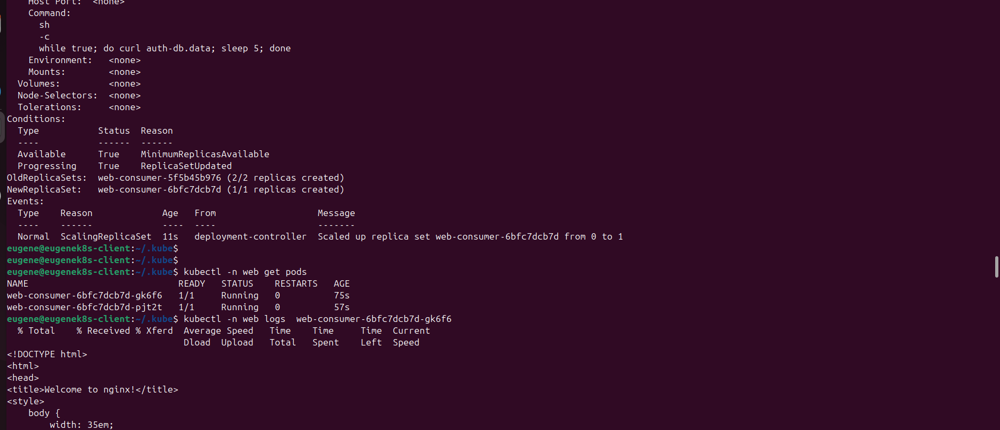

1. Установка приложения. Создание Namespaces. Состояние Deployments, Pods:

2. Ошибка в логах Pods web:

3. Проверяем описание deployment web-consumer. curl без учета namespace data в котором расположен auth-db pod:

kubectl  describe deployments.apps -n web web-consumer

while true; do curl auth-db; sleep 5; done

4. kubectl  edit deployments.apps -n web web-consumer

while true; do curl auth-db.data; sleep 5; done

