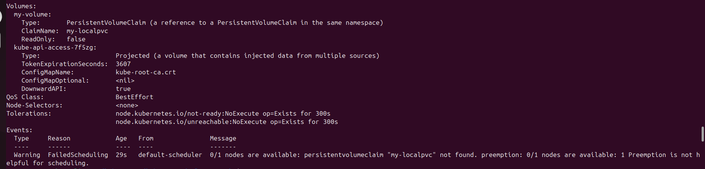
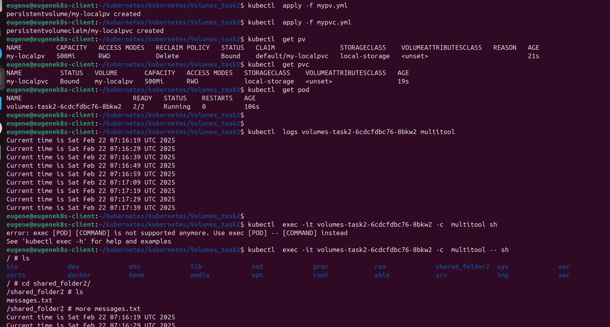
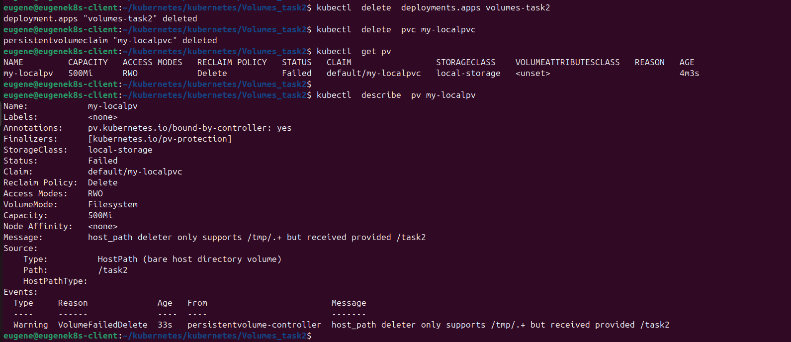
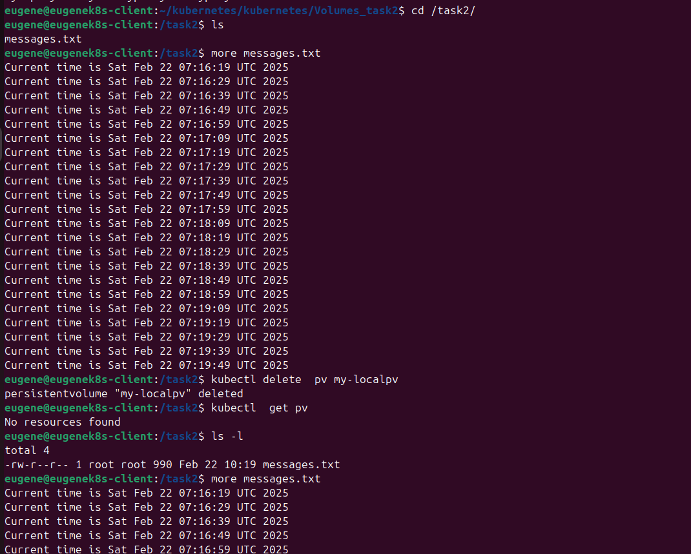
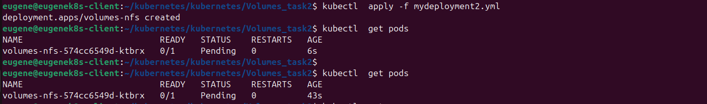
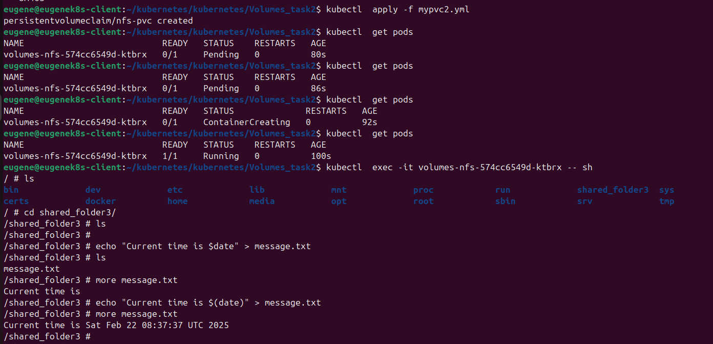

Task 1:
1. Применение манифеста Deployment. Состояние POD.

PVC not found:

2. Применение манифеста PV, PVC. Состояние POD - Running.

3. Удаление Deployment и PVC. Состояние PV.

"host_path deleter only supports /tmp/.+ but received provided /task2"

4. Файл на локальном хосте. Удаление PV. Проверка файла на локальном хосте.

5. Манифесты:

[Deployment](mydeployment.yml)

[PV](mypv.yml)

[PVC](mypvc.yml)

Task 2:

1. Применение манифеста Deployment. Состояние POD.

2. Применение манифеста PVC. Состояние POD.  

3. Манифесты:

[Deployment](mydeployment2.yml)

[PVC](mypvc2.yml)
